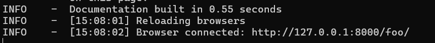

# Welcome to MkDocs

[MkDocs](https://hellowac.github.io/mkdocs-docs-zh/user-guide/writing-your-docs/) 是一个快速、简单的静态网站生成器，专门为项目文档设计。使用 MkDocs，你可以轻松创建和部署项目文档。

---

## 目录

- [简介](#简介)
- [安装](#安装)
- [快速入门](#快速入门)
- [基本命令](#基本命令)
- [项目结构](#项目结构)
- [配置文件详解](#配置文件详解)
- [主题与插件](#主题与插件)
- [部署](#部署)	
- [高级用法](#高级用法)
- [常见问题](#常见问题)


## 简介


MkDocs 是一个用于项目文档的静态网站生成器。它使用 Markdown 编写文档，并生成一个可发布的静态网站。


### 特点


- **简洁易用**：使用 Markdown 编写文档。
- **自动化生成**：一条命令即可生成文档网站。
- **主题丰富**：提供多种主题，满足不同需求。
- **插件支持**：通过插件扩展功能。


## 安装


你可以使用 pip 安装 MkDocs：

```bash
pip install mkdocs
```

安装完成后，可以通过以下命令验证安装是否成功：

```bash
mkdocs --version
```


##快速入门


创建一个新的 MkDocs 项目：

```bash
mkdocs new my-project
cd my-project
```

生成并查看文档：

```bash
mkdocs serve
```

这将在本地服务器上运行，并可以在浏览器中访问 http://127.0.0.1:8000/ 查看文档。如图：





##基本命令


MkDocs 提供了一些常用的命令：

- ```mkdocs new [dir-name]```：创建一个新的 MkDocs 项目。
- ```mkdocs serve```：在本地启动 MkDocs 开发服务器。
- ```mkdocs build```：构建静态站点文件。
- ```mkdocs help```：显示 MkDocs 的帮助信息。


##项目结构##


一个典型的 MkDocs 项目结构如下：

```plaintext
my-project/
    docs/
        index.md
        ...其他 Markdown 文件
    mkdocs.yml
```

- ```'doc/'```  目录存放所有的 Markdown 文档。

- ```'mkdocs.yml'```  是 MkDocs 的配置文件。


##配置文件详解##

-```mkdocs.yml```  是 MkDocs 的配置文件，用于定义站点的各项配置：

```yaml
site_name: My Docs
site_url: https://example.com
theme:
  name: material
nav:
  - Home: index.md
  - About: about.md
plugins:
  - search
markdown_extensions:
  - toc:
      permalink: true
```

主要配置项:

- ```'site_name'```  站点名称。

- ```'site_url'```  站点 URL。
 
- ```'theme'```  主题配置。

- ```'nav'```  导航栏配置。

- ```'plugins'```  插件配置。

- ```'markdown_extensions'```  Markdown扩展配置


##主题与插件


###主题

MkDocs 支持多种主题，常用主题包括 ```mkdocs``` 和 ```material```。可以在 ```mkdocs.yml``` 中配置主题：

```yaml
theme:
  name: material
```

###插件

插件可以扩展 MkDocs 的功能，例如搜索插件：

```yaml
plugins:
  - search
```

##部署


MkDocs 生成的静态文件可以部署到任何静态文件服务器上，例如 GitHub Pages、Netlify、Vercel 等。

###部署到 GitHub Pages

- 在 GitHub 上创建一个新的仓库。

- 将 MkDocs 站点构建的文件推送到仓库：

```bash
mkdocs gh-deploy
```

这将自动将 ```site``` 目录中的文件推送到 ```gh-pages``` 分支并部署到 GitHub Pages。


##高级用法


###自定义主题

你可以自定义主题，以满足特定需求。创建一个 ```theme``` 目录，并在 ```mkdocs.yml``` 中配置：

```yaml
theme:
  custom_dir: theme
  name: null
```

###使用插件

MkDocs 有许多社区插件，可以在 [MkDocs](https://github.com/mkdocs/mkdocs/wiki/MkDocs-Plugins) 插件目录 找到更多插件。

###集成 CI/CD

你可以将 MkDocs 与 CI/CD 工具（如 GitHub Actions、Travis CI）集成，实现自动化构建和部署。


##常见问题


-  ###如何更改站点的根 URL？

在 ```mkdocs.yml``` 中配置 ```site_url```：

```yaml
site_url: https://yourdomain.com
```

-  ###如何添加自定义 CSS 和 JavaScript？

在 ```docs``` 目录中创建 ```extra.css``` 和 ```extra.js``` 文件，并在 ```mkdocs.yml``` 中引用：

```yaml
extra_css:
  - css/extra.css
extra_javascript:
  - js/extra.js
```

-  ###如何调试 MkDocs 配置？

可以使用 ```mkdocs serve``` 命令启动本地服务器，在浏览器中查看实时效果，并根据需要修改配置文件。


---

